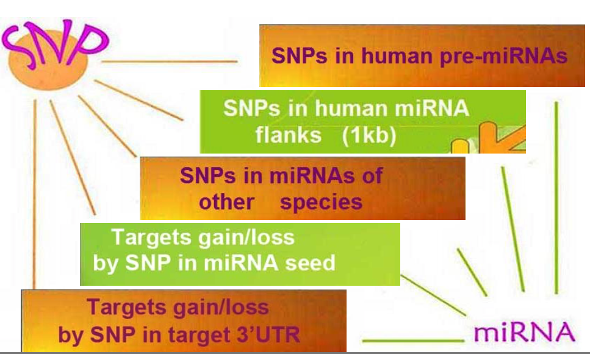

# miRNASNP

> [Genome-Wide Identification of SNPs in MicroRNA Genes and the SNP Effects on MicroRNA Target Binding and Biogenesis](http://www.ncbi.nlm.nih.gov/pubmed/22045659)
J Gong, Y Tong, HM Zhang, K Wang, T Hu, G Shan, J Sun*, and AY Guo*.    Human Mutation 2011;DOI: 10.1002/humu.21641

# Introduction
MicroRNAs (miRNAs) are endogenous ~22 nt non-coding RNAs which play important regulatory roles in animals and plants by targeting mRNAs for cleavage or translational repression. Some SNPs in pre-microRNAs, flanking regions or target sites have been demonstrated to affect certain physiological processes or related with diseases. The aim of miRNA related SNP database is to provide a resource of the miRNA-related SNPs, which included SNPs in human pre-miRNAs and miRNA flanks, SNPs in other species's miRNAs, and target gain and loss by SNPs in miRNA seed regions or 3'UTR of target mRNAs. Thus, Five major modules are provided in this database and users can browse or search it in different levels.

# Databases

